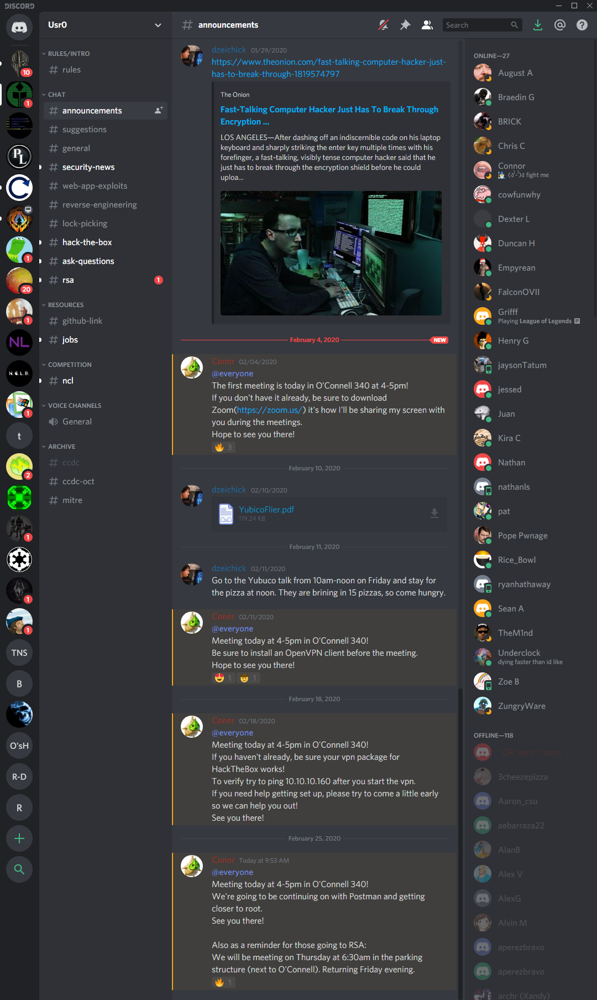
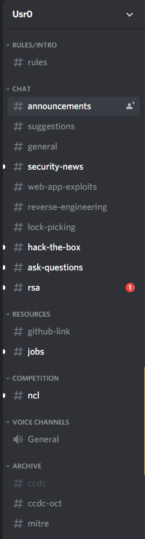
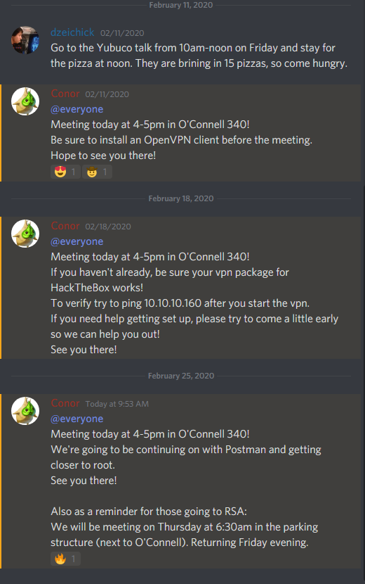
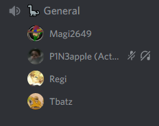
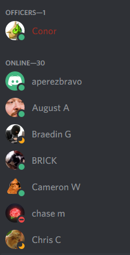

# UX Portfolio

  

<!-- Line breaks hahaha! -->
 

  &nbsp;&nbsp;&nbsp;&nbsp; Hello! My name is Henry Graves, I am a Computer Science major at CSU Chico.
  This is my UX portfolio for CSCI 431 Usability Engineering.
  I am fairly interested in this class as coding software is already something I can do, however, design
  has always come second to me, having some solid foundation for an approach to UI/UX other than "I think this looks alright" 
  will be very nice to utilize in future projects.

## UX Team Project

## UX Journal

<b><h3> The Discord User's Experience </h3></b>
<h4>By Henry Graves | 2/25/2020</h4>

&nbsp;&nbsp;&nbsp;&nbsp; Discord above all else, is a communication app. Many users of the app are game focused, however, it's use cases stretch from games to school classes to professional project collaboration. In this entry I will describe my experience using Discord, the goals I had, my interactions with the app, as well as what the outcomes were.  
  

 

&nbsp;&nbsp;&nbsp;&nbsp; Recently I have been using Discord for academic purposes, mainly to communicate with classmates when 
solving homework problems or about topics covered in class. When you open up the app, it presents you with a list of the servers you 
are currently in on the left hand side of the screen. These servers are idicated with a logo that the owners of the server choose.

<!-- insert image of server list -->

  

&nbsp;&nbsp;&nbsp;&nbsp; The second most left-hand column is the current server's text and voice channels depicted either with a pound sign for text, or a speaker icon for voice. This is an excelent example of <b>natural mapping</b> as in todays world we associate a pound sign with some form of text, usually in the form of a hashtag on social media and ofcourse a speaker symbol indicates that you're going to hear something, particularly voices in this context.
  

<!-- insert image of text/voice channels -->

  

&nbsp;&nbsp;&nbsp;&nbsp; From here, a user can click on any text channel to see the chat of that channel. The chat appears in the center of the screen and has the most screen real estate which is ideal considering this is where a user will spend most of their time with their eyes. 

<!-- insert image of a text channel chat -->

  

If a user decides to enter a voice channel, this will be indicated by showing the user's name and profile picture under the channel name.
 

<!-- insert an image of voice users -->

  

&nbsp;&nbsp;&nbsp;&nbsp; Finally, on the far right-hand side of the app will be a list of server members showing the user all other users that are currently in a server.
  

<!-- insert an image of user list -->

  

&nbsp;&nbsp;&nbsp;&nbsp; As stated previously I use discord for many things, one of which is keeping up with Chico State's Cybersecurity club Usr0. At a glance I can see if there have been any new announcements for the club by looking at the text chat channel #announcements. If this channel title is highlighted, it means there has been a new message posted to the chat. I can also see which of my friends from the club is online by looking to the right hand side and viewing the members list, if they have a green icon next to their profile picture, I know they are online. In all honesty one of the only things I would change about the design layout is the ability to swap certain sections of the UI. For example, I'd sometimes like to be able to have the online users show up on the left hand side of the screen and all of the chat and voice channels show up on the right side of the screen, effectively just swapping the two.

